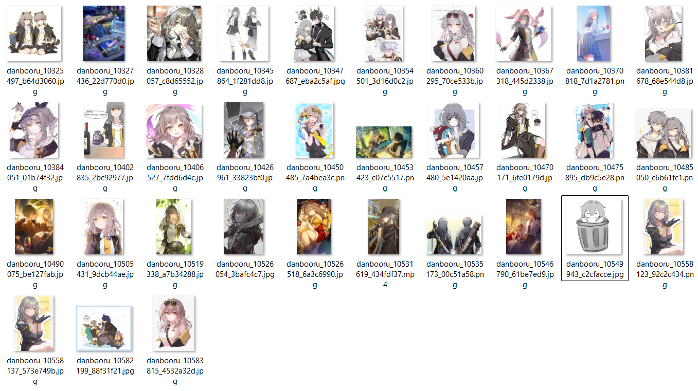

# MoeScraper

Anime picture scraper toolkit. Scrape & download images by tags from multiple sources (Danbooru / Safebooru / Zerochan), with rate limiting, retries, progress bar, and metadata export. You can use it to collect data for model / adapter (LoRA / LoRA+ / etc.) training.

---

## Features

- Multi-source scraping via simple adapter interface
- Tag-based search scraping to a target count (`client.scrape_images(...)`)
  - Progress bar
  - Resume support
- Concurrent downloading (thread pool)
- Metadata export:
  - **JSONL** during scraping

---

## How to use it

First, you need to install the package. You can copy this command and paste it in your terminal.

```bash
pip install "moescraper @ git+https://github.com/luminolous/moescraper.git"
```

And then, copy the code below and you can adjust it for the parameter settings.

```python
from moescraper import MoeScraperClient

client = MoeScraperClient()

client.scrape_images(
    source="danbooru",                                # "danbooru" | "safebooru" | "zerochan"
    tags=["stelle_(honkai:_star_rail)", "1girl"],     # your image tags: based on each website
    n_images=1000,                                    # input your target total images
    nsfw_mode="safe",                                 # "safe" | "all" | "nsfw"
    out_dir="moescraper_result/images",
    meta_jsonl="moescraper_result/metadata.jsonl",
    index_db="moescraper_result/index.sqlite",
    state_path="moescraper_result/scrape_state.json",
    limit=200,                                        # per-page fetch size
    max_workers=2,                                    # download concurrency
)

client.close()
```

And the output will look like this:

```
moescraper_result/
  images/                # downloaded images folder
  metadata.jsonl         # JSONL lines for downloaded posts
  index.sqlite           # SQLite index for dedupe/track exported
  scrape_state.json      # resume cursor (page pointer)
```

---

## Example Result

This is an example of the scraping results folder.



---

## NSFW Modes

- `safe` → keep **safe / non-explicit** only
- `all`  → keep everything
- `nsfw` → keep **nsfw** only

> Rating quality depends on each source; treat it as best-effort.

---

## Disclaimer

>This project is for educational/research purposes. Please respect each website’s Terms of Service and the content licenses.
Use polite rate limits.

---

## Supported Sources

- [**Danbooru**](https://danbooru.donmai.us) (`danbooru`)
- [**Safebooru**](https://safebooru.org/) (`safebooru`)
- [**Zerochan**](https://www.zerochan.net/) (`zerochan`)